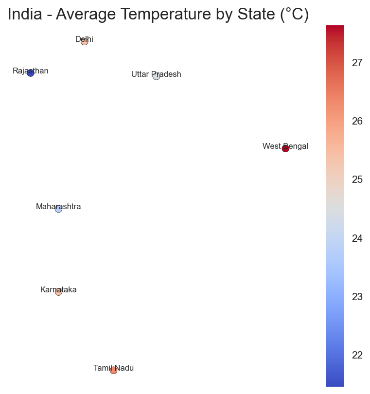
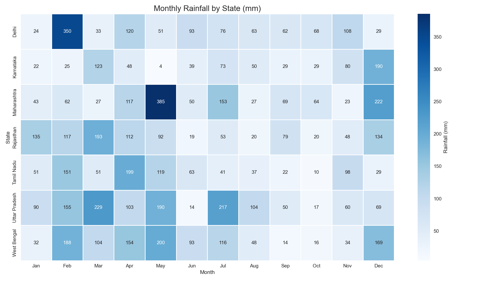

# 🌦️ MonsoonViz: India Weather Intelligence Dashboard



**MonsoonViz** is a professional-grade visualization toolkit for analyzing India's weather patterns through beautiful, insightful visualizations powered by Python's scientific stack.

## ✨ Features

- **Multi-Dimensional Analysis**:
  - 🌡️ Temperature heatmaps by state
  - 🌧️ Monthly rainfall patterns
  - 🌬️ Wind pattern visualizations (optional)
- **Smart Data Handling**:
  - Works with real weather APIs or CSV data
  - Auto-generates realistic sample data
  - Geographical fallback systems
- **Professional Outputs**:
  - Static PNGs for publications
  - Interactive HTML dashboards
  - Mobile-responsive designs

## 🚀 Quick Start

### Prerequisites
- Python 3.8+
- GeoPandas dependencies (see installation notes)

### Installation
```bash
git clone https://github.com/yourusername/monsoonviz.git
cd monsoonviz
pip install -r requirements.txt
```

### Basic Usage
```bash
python dashboard.py
```
Outputs will be saved to `assets/` folder.

## 📂 Data Preparation

### Using Real Data
1. Place these files in `data/processed/`:
   - `temperature_data.csv` (columns: State, Month, Avg_Temp)
   - `rainfall_data.csv` (columns: State, Month, Rainfall) 
   - `india_states.shp` (shapefile for geographical plots)

2. Sample CSV format:
```csv
State,Month,Avg_Temp
Maharashtra,Jan,22.5
Maharashtra,Feb,24.1
```

## 🌐 Sample Visualizations

### Temperature Heatmap

- Color-coded by average temperature
- State-level granularity
- Interactive version available

### Rainfall Patterns

- Monthly comparisons
- State-wise breakdown
- Annotated values

## 🛠️ Customization

### Style Configuration
```python
# In dashboard.py:
plt.style.use('seaborn-v0_8')  # Alternatives: 'ggplot', 'dark_background'
```

### Advanced Options
```python
# Change visualization parameters:
plt.figure(figsize=(16, 10))  # Larger output
plt.savefig(dpi=300)          # Higher resolution
```

## 💡 Pro Tips

1. **For IMD Data Integration**:
   ```python
   # Use this API for real-time data:
   # https://mausam.imd.gov.in/
   ```

2. **Enhance With**:
   ```bash
   pip install xarray cartopy
   # For advanced geographical plots
   ```

## 🐛 Troubleshooting

| Issue | Solution |
|-------|----------|
| Missing shapefile | Uses fallback coordinates |
| Style errors | Try 'ggplot' instead of 'seaborn' |
| GeoPandas issues | Install via conda: `conda install geopandas` |

## 🤝 Contributing

We welcome:
- New visualization types
- Additional data sources
- Performance optimizations
- Documentation improvements

**Contribution Guide**:
1. Fork the repository
2. Create your feature branch
3. Submit a pull request

## 📜 License

MIT License - Free for academic and commercial use

---

**Weather Researchers**: Combine with [IMD datasets](https://mausam.imd.gov.in/) for operational forecasting!
